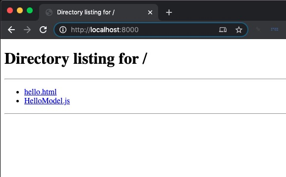
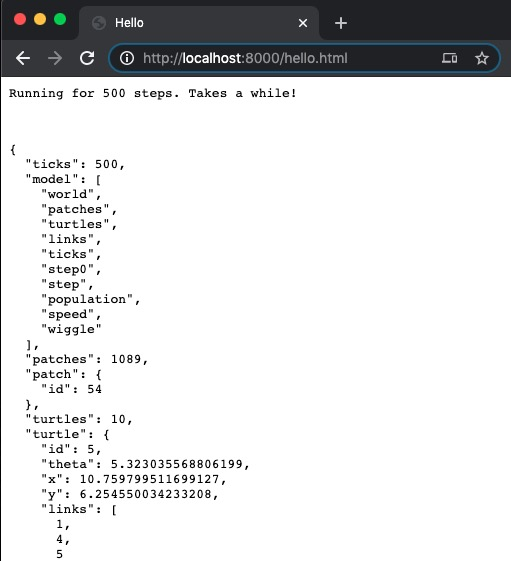

Lets build a local http server for you to test HelloModel.js & HelloHtml.js.

### Mozilla Developer Network
The MDN has a nice [article on local dev servers.](https://developer.mozilla.org/en-US/docs/Learn/Common_questions/set_up_a_local_testing_server) They use Python which comes with a simple HTTP server module built-in.

If you are on a Mac, it's likely already installed. Depending on which version of MacOS you have, one or both of these should work:

* python3 -m http.server
* python -m SimpleHTTPServer

If you do not have python installed, the article above leads you through the process. Follow their instructions for starting the python server in your working directory.

At this point [http://localhost:8000/](http://localhost:8000/) in your browser uses our Python HTTP server.

### Create a Models Folder

Lets finally run the HelloModel.js with hello.html using the new server.

First, create an empty folder. Any name is fine, I'll use models/

Then cd to models and cut/paste the tutorial code to HelloModel.js and hello.html.

Inside that folder, startup your server. I'm using `python3 -m http.server`.

Cut/paste `http://localhost:8000/` into your browser.  You should see something like this:

Click on hello.html to see the model run and report a sampling of the final state of the model. This will differ each run due to the random nature

### Views: Seeing the model run

It probably seems odd that thus far we've only "seen" the model by having it's html script printing out a sample of the model's properties.

This is the MVC at work: the Model only creates numbers .. a dynamic DataSet creator.

So how about a "V" now to see how that works.

Next, {@tutorial HelloView}: Adding a View to hello.html.

