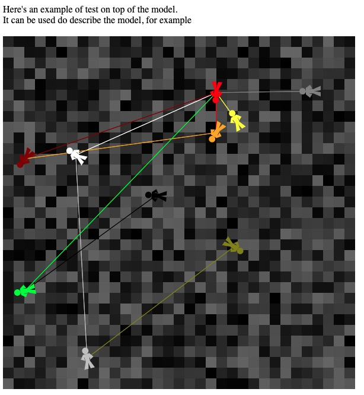

Now we add a View to our HelloModel.js with a new html file, view.html.

### First, simplify hello.html
Copy hello.html to helloview.html, and remove all the comments and the util.printToPage use.  You end up with:

```javascript
<html>
    <head>
        <title>HelloView</title>
    </head>
    <body>
        <script type="module">
            import TwoDraw from 'https://agentscript.org/src/TwoDraw.js'
            import util from 'https://agentscript.org/src/util.js'
            import Model from './HelloModel.js'

            async function run() {
                const model = new Model()
                await model.startup()
                model.setup()

                await util.timeoutLoop(() => {
                    model.step()
                }, 500)
            }
            run()
        </script>
    </body>
</html>
```
Not much left!

### TwoView & TwoDraw

There are several Views available for us to use. We'll use the simplest HTML Canvas version, src/TwoDraw.js. It is a subclass of a more basic src/TwoView.js with easy to use drawing options.

`import TwoDraw from 'https://agentscript.org/src/TwoDraw.js'`

We'll then create an instance of TwoDraw just underneath ` model.setup()`
```javascript
    const view = new TwoDraw(
        model,
        {
            // Use default TwoView options
        },
        {
            // Use default TwoDraw options
        }
    )
```

We'll then run the view's draw() method right after model.step(). And we'll add a "speed" value to the timeoutLoop to change from 60fps (the default) to 30fps .. slower so we can see watch the 500 steps more clearly.
```javascript
    await util.timeoutLoop(
        () => {
            model.step()
            view.draw()
        },
        500,
        33
    )
```

So the run() async function now looks like:
```javascript
    async function run() {
        const model = new Model()
        await model.startup()
        model.setup()

        const view = new TwoDraw(
            model,
            {
                // Use default TwoView options
            },
            {
                // Use default TwoDraw options
            }
        )

        await util.timeoutLoop(
            () => {
                model.step()
                view.draw()
            },
            500,
            33
        )
    }
```

It will look like this:


### Options
Lets show use of the options.

First, add these two divs right after the closing script tag:
```html
        ...
    </script>
    <div id="modelNotes">
        Here's an example of test on top of the model.</br>
        It can be used do describe the model, for example</br></br>
    </div>
    <div id="modelDiv"></div>
```

Then add these View and Draw options:
```javascript
    const view = new TwoDraw(
        model,
        {
            div: 'modelDiv',
            patchSize: 18
        },
        {
            turtlesSize: 2,
            turtlesShape: 'person'
        }
    )
```

This looks like:



### Other views

Separating the Model from the View gives us a lot of options for integrating Models into different environments. This is the goal of the MVC architecture.

Here's an example of a Model running in a [Three.js View](https://agentscript.org/views3d/hello.html). (We've modified the HelloModel slightly to use the z coordinates)

And here's an example of running a Model in [Mapbox](https://agentscript.org/gis/countywalker.html), a GIS library. If you open the browser's console, you'll see the Model has been slightly modified to report the county when a turtle goes from one county to another.

The Models can also be run in two interesting environments due to their simplicity:
* [Web Workers](https://developer.mozilla.org/en-US/docs/Web/API/Web_Workers_API): Because the Models have no drawing, they do not need to access the browser's DOM (Document Object Model). Workers can run much faster because they do not use the DOM's shared threads. Our use of the async timeoutLoop is an example of sharing the DOM's thread, stepping the model and view then pausing so as to not block the browser's other pages.

Indeed, AgentScript's testing technique is to run all our sample models in workers. This doubles or more our testing speed.

* [Node](https://nodejs.org/en/): Node is a desktop JavaScript environment used as a server or as a script runner such as the testing mentioned above. Because the Model's use no drawing or other browser specific capabilities, the models can be run in Node.

This allows very interesting distributed computing capabilities such as a Model running on a server while being drawn locally using a View running in the browser.